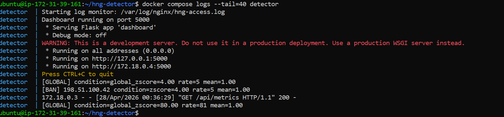
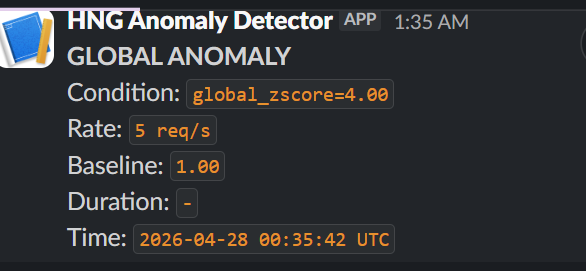
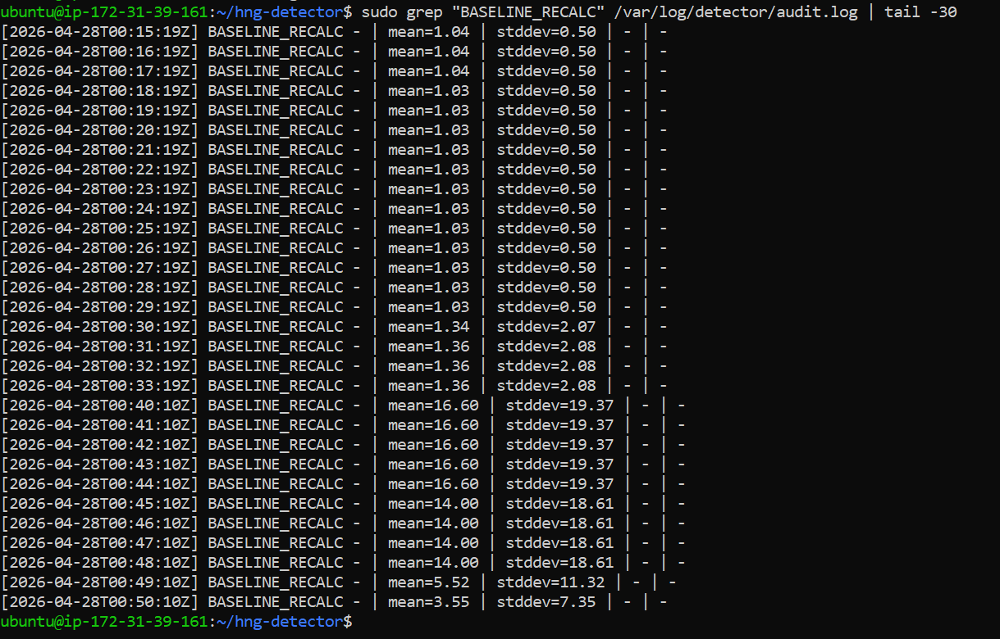
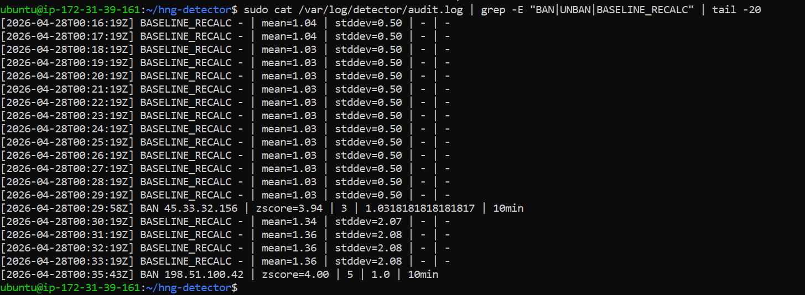
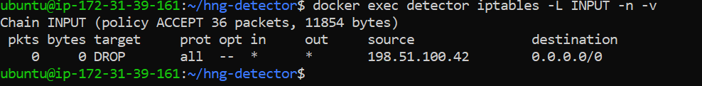
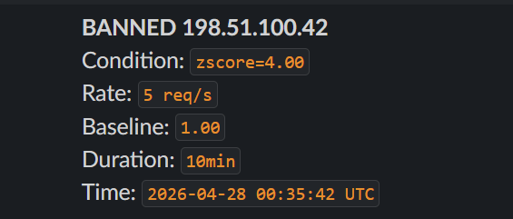
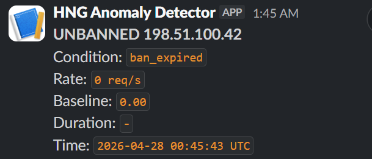

# HNG Stage 3 - Anomaly Detection Engine

## Live URLs
- **Metrics Dashboard:** http://hng14why.duckdns.org:8080
- **Server IP:** 23.22.241.56
- **Nextcloud:** http://23.22.241.56 (IP access only)
- **Blog Post:** https://henrycloud.hashnode.dev/how-i-built-a-real-time-ddos-detection-engine-from-scratch
- **GitHub Repo:** https://github.com/Nweke-cloud/hng-stage3-detector

## Language Choice
Python — chosen for rapid development, excellent stdlib support for
threading and deque, and straightforward subprocess calls for iptables.
The entire detection logic fits in under 300 lines with no external
rate-limiting libraries.

## How the Sliding Window Works
Two deque-based windows track requests over the last 60 seconds:
- Per-IP window: deque of (timestamp, is_error) tuples
- Global window: deque of timestamps

On every new request the entry is appended. Before checking the rate,
entries older than 60 seconds are evicted from the left:

    while dq and dq[0][0] < now - 60:
        dq.popleft()

This gives O(1) append and O(1) eviction. The length of the deque
equals the request count in the last 60 seconds — that is the rate.

## How the Baseline Works
- Window size: 30 minutes of per-second request counts stored in a deque
- Recalculation: every 60 seconds in a background thread
- Per-hour slots maintained separately — current hour preferred when
  it has 10+ samples, adapting to time-of-day patterns automatically
- Floor values: mean=1.0, stddev=0.5, error_mean=0.1
- Formula: mean = sum(counts)/n, stddev = sqrt(sum((x-mean)^2)/n)
- Every recalculation writes a structured entry to the audit log

## Detection Logic
An IP is flagged anomalous if either condition fires first:
1. Z-score > 3.0: (rate - mean) / stddev > 3.0
2. Rate multiplier: rate > 5 * mean

Error surge tightening: if an IP error count exceeds 3x the error
baseline mean, both thresholds tighten to 70% of normal values.

Global anomaly uses the same logic against the total request rate.
Global anomalies trigger a Slack alert only — no IP block.

## iptables Blocking
Ban:   iptables -I INPUT -s <ip> -j DROP
Unban: iptables -D INPUT -s <ip> -j DROP

Unban backoff schedule: 10min -> 30min -> 2hrs -> permanent

## Setup Instructions

### Prerequisites
- Ubuntu 22.04 VPS, minimum 2 vCPU 2GB RAM
- Ports 80 and 8080 open in firewall

### Install Docker
    curl -fsSL https://get.docker.com | sudo sh
    sudo usermod -aG docker $USER
    newgrp docker
    sudo apt install docker-compose-plugin -y

### Deploy
    git clone https://github.com/Nweke-cloud/hng-stage3-detector.git
    cd hng-stage3-detector
    echo "SLACK_WEBHOOK_URL=your_webhook_url" > .env
    docker compose up -d --build

### Verify
    curl http://YOUR_IP:8080/api/metrics

### Successful Startup Output
    detector | Starting log monitor: /var/log/nginx/hng-access.log
    detector | Dashboard running on port 5000
    detector |  * Running on http://0.0.0.0:5000

## Repository Structure
    detector/
      main.py         - Orchestrator, log processing loop
      monitor.py      - Tails and parses nginx JSON access log
      baseline.py     - Rolling 30-min baseline, per-hour slots
      detector.py     - Z-score and rate multiplier detection
      blocker.py      - iptables ban/unban with backoff schedule
      unbanner.py     - Scheduled unban helper
      notifier.py     - Slack webhook and audit log writer
      dashboard.py    - Flask dashboard, /api/metrics endpoint
      config.yaml     - All thresholds and configuration
      requirements.txt
    nginx/
      nginx.conf      - JSON access log, reverse proxy config
    docs/
      architecture.md
    screenshots/
      Tool-running.png
      Ban-slack.png
      Unban-slack.png
      Global-alert-slack.png
      Iptables-banned.png
      Audit-log.png
      Baseline-graph.png
    README.md

## Screenshots

### Tool Running

### Ban Slack Alert

### Unban Slack Alert

### Global Alert Slack

### iptables Banned

### Audit Log

### Baseline Graph

